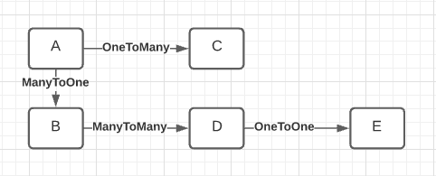

# JE 140

## Задачи Первого модуля

### 1.1 Задание
  * Создание мультимодульного проекта с помощью Maven
  * Название модулей: 
    * web-app, 
    * gateway-app, 
    * data_base-app, 
    * service-app
  * В каждом модуле должна быть идентичная структура корневых каталогов
      * /src/main/java/by/ita/je/
      * /src/test/java/by/ita/je/
  * Каждый модуль полностью независим и собирается в jar файл

### 1.2 Задание
  * В модуле 1 создать класс M1App.java в котором реализовать пустой стартер.
  * В модуле 1 создать класс FirstService.java
    * Класс должен содержать метод, не пустой с минимум 1 параметром, 
      без использования примитивных типов
    * Напишите тест к этому методу.

### 1.3 Задание
  * Подключить репозиторий к своему проекту
  * Сделать запрос на добовление изменений в ветку с вашей фамилией
  * Пройти ревью и получить разрешение на слияние вашей локальной ветки с удаленной

### 1.4 Задание
  * Переоформить все модули в Spring Boot проекты, собраные мавеном.
  * Каждый спринг модуль должен подниматься на собственном порту
    * порты: web-app = 8001
    * порты: gateway-app = 8002
    * порты: data_base-app = 8003
    * порты: service-app = 8004
  * Каждый спринг модуль должен иметь собственный contextPath соответственно
    * contextPath: /web-app
    * contextPath: /gateway-app
    * contextPath: /data_base-app
    * contextPath: /service-app
  * Сделать запрос на добовление изменений в ветку с вашей фамилией
  * Пройти ревью и получить разрешение на слияние вашей локальной ветки с удаленной

## Задачи Второго модуля
Каждое задание офоомляем в отдельной ветке, отдельным МР, формат имен для веток `2-1-wasileuski`, в МР добовляем майл стоун соответствующего модуля

### 2.1 Задание 
  * Соблюдайте правила "слоения" и структуру папок в проекте, `SOLID` принципы!
  * В модуле `data_base-app` создать 4 сущности `MODEL`, разного назначения.
    * Пользоваться Ломбоком, нельзя!
    * В каждой сущности должно быть минимум 8 полей, не больше 2 одинаковых типов полей на класс.
    * Сущности должны собираться через паттерн `Builder`.
    * В каждой сущности должно быть одно поле типа `ZoneDateTime`.
  * В модуле `data_base-app` создать 4 сущности `DTO` согластно ваши моделям.
    * В ваших `DTO` не длжны быть показаны поля `ID` и `ZoneDateTime` типа.
    * `DTO` должны иметь в общем на 4 поля меньше чем соответствующая `MODEL`.
  * В модуле `data_base-app` создать `REST` контроллеры, для `CRUD` задач под каждую созданую `DTO`(отдельный класс контроллер для каждой дто).
    * Чтение всех записей, удаление списком, поиск списком обязательны
    * Реализовать контроллеры используя переменные пути, переменные запроса, тело запроса. Не нарушая конвенцию типов запросов и их назначения!
    * Контроллеры должны возвращать ответы `DTO` сущностями в формате `JSON`.
    * Маппинг контроллеров должен содержать существительные, говорящие о назначении эндпоинта.

### 2.2 Задание
  * Соблюдайте правила "слоения" и структуру папок в проекте, `SOLID` принципы!
  * В модуле `data_base-app` создать `DAO` для каждой модели.
  * В модуле `data_base-app` создать папку с исключениями.
    * Создать 2 исключения, для случая если данные не были найдены, или полученные данные не корректны/полны.
    * Исключения обязательно имеют конструктор со строковыи параметром, куда мы будем передовать поясняющий текст.
    * В конструкторе исключений пишем лог, для логгера можно использовать ломбок.
  * В модуле `data_base-app` создать `Service` для каждого `DAO`.
    * В сервисах должны добавляться данные, которых не было в `DTO`(кроме `ID`)
    * Вы можете добавить небольшую логику на свое усмотрение, для полей которые не были получены из вне.
    * Если данные полученные из вне не позволяют создать модель, вы должны бросить исключение.
    * Процесс маппинга `DTO` в `MODEL` и обратно, не должен быть частью логики сервиса, сервис в идеале не должен знать об `DTO`.
    * Поиск единичных элементов должен возвращать либо данные, либо бросать исключение.
  * Для каждого открытого метода сервиса должен быть написан тест, используйте `JUNIT` и `Mockito`.
    * Для каждого метода, тест должен покрывать "позитивный случай", когда метод отрабатывает как положено и если метод может бросать исключения, то пишем тест для этого случая.
  * В модуле `data_base-app` создать подключение к базе, используйте `H2` в режиме "в памяти".

### 2.3 Задание
  * Установите `Postman` и проверьте все ваши контроллеры.
    * Создайте коллекцию в постмане, с папками для каждого из ваших контроллеров.
    * В каждой папке, должны быть сохранены все запросы на контроллер.
    * Создайте папку в проекте `postman-uat` и экспортируйте туда свою коллекцию.

### 2.4 Задание
* Соблюдайте правила "слоения" и структуру папок в проекте, `SOLID` принципы!
* Соблюдайте соглашения по именовании форматирование кода.
* Добавьте в ваши модели 1 сущность типа `ENUM` для определения неких константных состояний.
    * Для данной модели, ваше дао должно быть реализовано на уровне Hibernate, с помощь `EntityManger`.
* Из ваших 4-х(A,B,C,D) моделей соберите структуру, с логическим и очевидным бизнес процессом, опираясь на схему 
      ниже, где E это 5-ая созданная вами модель `ENUM`.
      
  
      
    * Создайте отдельный сервис для бизнес процесса который будет работать с 4 мя предыдущими.
    * Этот сервис должен иметь поведение, - процесс добавления данных для А, обогащения А данными из В и С, так
    же должна быть описана логика по добавлению данных D и E по условию. Этот сервис не может на прямую обращаться к `DAO`.
    * Этот сервис должен иметь поведение, - изменения данных А и связанных с ним C, B, D, E.
    * Этот сервис должен иметь поведение, - чтение А с глубиной вложенности до В, С.
    * Этот сервис должен иметь поведение, - удаление А и всех ЗАВИСИМЫХ от А сущностей. Т.е. Если записи А не 
      существует, то смысл существования записей B,C,D,E пересматривается (зависит от бизнес логики ваших связей).
* `DTO` должны отображать связи моделей аналогичным образом.
* Создайте контроллер по нужды вашего сервиса.

### 2.5 Задание
* Соблюдайте правила "слоения" и структуру папок в проекте, `SOLID` принципы!
* Соблюдайте соглашения по именовании форматирование кода.
* Создайте метод в вашем контроллере из задания 2.5, который будет принимать `FiltedDTO`.
    * `FiltedDTO` - позволяет передавать информацию для поиска по полям классов A,B,C,D и E.
    * Для числовых значений вы можете задавать диапазон "подходящих результатов".
* Создайте метод для вашего сервиса из 2.5, который опираясь на данные `FiltedDTO` будет производить поиск по таблицам.
    * Таблица А ваш опорный элемент для поиска, результат поиска всегда предполагает возвращение А сущности, 
      со вложенностью определенной критериями поиска. Например вы ищите все А у которых есть элементы E, то выш вывод 
      должен включать все данные по иерархической цепочке от А до Е.
    * Для запросов к базе данных нужно использовать хотя бы раз подходы:
        * [JPQL](https://www.baeldung.com/spring-data-jpa-query)
        * [HQL](https://www.baeldung.com/hibernate-named-query)
        * [Criteria Queries](https://www.baeldung.com/hibernate-criteria-queries)
    * Используйте - [Metamodel](https://www.baeldung.com/hibernate-criteria-queries-metamodel) в качестве констант 
      для имен полей таблиц.
* Напишите тесты для всех новых методов.
